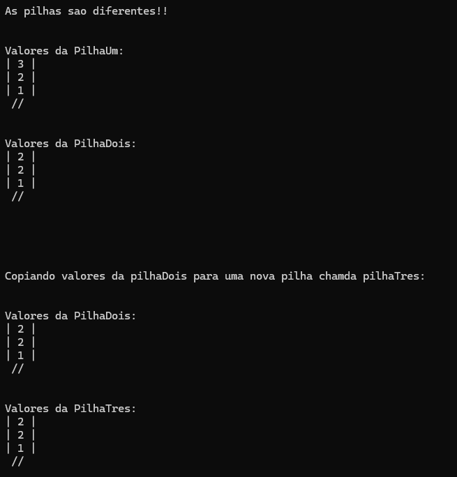

<h1 align="center">Pilha Dinâmica</h1>

<p align="center">
  <strong>Implementação de uma Pilha Dinâmica em C com lista encadeada</strong><br>
  Estrutura de dados que segue o princípio LIFO (Last In, First Out) com alocação dinâmica de memória.
</p>

## Tópicos

- [Sobre o Projeto](#sobre-o-projeto) 
- [Conceito LIFO](#conceito-lifo) 
- [Estrutura do Projeto](#estrutura-do-projeto)  
- [Funcionalidades](#funcionalidades)  
- [Tecnologias](#tecnologias)  
- [Como executar o projeto](#como-executar-o-projeto)
- [Imagens do Projeto](#imagens-do-projeto)


# Sobre o Projeto
Este projeto implementa uma **Pilha Dinâmica** em linguagem C, utilizando lista encadeada como estrutura subjacente. O objetivo é demonstrar os conceitos de estrutura de dados, alocação dinâmica de memória e o comportamento LIFO (Last In, First Out) de uma pilha. O código está organizado com separação entre arquivos de cabeçalho (`.h`) e implementação (`.c`).

Os valores testados no programa são **pré-definidos no código** para demonstrar as funcionalidades da pilha. A pilhaUm recebe os valores 1, 2 e 3, enquanto a pilhaDois recebe os valores 1, 2 e 2, permitindo a comparação entre as duas estruturas.

# Conceito LIFO

A pilha é uma estrutura do tipo **LIFO (Last In, First Out)** — "Último a entrar, primeiro a sair". Isso significa que o último elemento inserido na pilha será o primeiro a ser removido. Imagine uma pilha de pratos: você coloca os pratos um sobre o outro e só pode pegar o prato que está no topo.

A **pilha dinâmica** não possui um tamanho máximo pré-definido, podendo crescer conforme a necessidade, utilizando alocação dinâmica de memória.


# Estrutura do Projeto

```
pilha-dinamica/
├── include/
│   ├── pilha_lista.h   # Estrutura da pilha e protótipos
│   └── no.h            # Estrutura do nó para lista encadeada
├── src/
│   ├── main.c          # Programa principal com testes
│   ├── pilha_lista.c   # Implementação das operações da pilha
│   └── no.c            # Implementação dos nós
├── readme-img/
│   └── resultado.png   # Imagem da execução
├── .gitignore
└── CMakeLists.txt      # Configuração do CMake para CLion

```

### `include/`

#### `pilha_lista.h`
- Define a estrutura `t_pilha` com ponteiro para o topo e contador `tamanho`
- Protótipos das funções:
  - `inicializa_pilha` - Inicializa a pilha vazia
  - `esta_vazia` - Verifica se a pilha está vazia
  - `empilha` - Insere elemento no topo da pilha
  - `desempilha` - Remove elemento do topo da pilha
  - `mostra_pilha` - Exibe todos os elementos da pilha
  - `sao_iguais` - Compara duas pilhas
  - `copiar_pilha` - Copia uma pilha para outra

#### `no.h`
- Define a estrutura `t_no` para os nós da lista encadeada
- Protótipo da função `constroi_no` para criação dinâmica de nós

### `src/`

#### `main.c`              
- Programa principal que demonstra o uso da pilha dinâmica
- **Valores pré-definidos:** pilhaUm recebe 1, 2, 3 | pilhaDois recebe 1, 2, 2
- Realiza comparação entre as pilhas, exibição e cópia

#### `pilha_lista.c`       
- Implementação das funções de manipulação da pilha dinâmica

#### `no.c`       
- Implementação da criação e gerenciamento dos nós


# Funcionalidades
- ✅ **Inicialização** da pilha dinâmica (vazia)
- ✅ **Empilhar (push)** - Inserção de elementos no topo da pilha
- ✅ **Desempilhar (pop)** - Remoção de elementos do topo da pilha
- ✅ **Verificação** se a pilha está vazia
- ✅ **Exibição** visual do conteúdo atual da pilha (do topo à base)
- ✅ **Comparação** entre duas pilhas para verificar se são iguais
- ✅ **Cópia** de uma pilha para outra
- ✅ Alocação dinâmica de memória para cada novo elemento


# Tecnologias
<table align="center">
     <tr>
        <th>
            Linguagem
        </th>
        <td>
            
        </td>
    </tr>
     <tr>
        <th>
            IDE
        </th>
        <td>
            
        </td>
     </tr>
     <tr>
        <th>
            Build System
        </th>
        <td>
            
        </td>
     </tr>
</table>


# Como executar o projeto

### Opção 1: CLion (Recomendado)

1. Clone este repositório:
```bash
git clone https://github.com/pedro-Trovo/pilha-dinamica
```

2. Abra o CLion e selecione **File → Open**

3. Escolha a pasta do projeto `pilha-dinamica`

4. O CLion irá automaticamente:
   - Detectar o arquivo `CMakeLists.txt`
   - Executar o CMake
   - Criar a configuração de build

5. Clique no botão **▶️ (Run)** no canto superior direito

6. O programa será executado e os resultados aparecerão no terminal integrado do CLion

### Opção 2: Terminal com GCC

1. Clone este repositório:
```bash
git clone https://github.com/pedro-Trovo/pilha-dinamica
```

2. Acesse a pasta do projeto:
```bash
cd pilha-dinamica
```

3. Compile o projeto com gcc:
```bash
gcc -o pilha src/main.c src/no.c src/pilha_lista.c -Iinclude
```

4. Execute o programa:
```bash
# Windows
pilha.exe

# Linux/Mac
./pilha
```

### Opção 3: Terminal com CMake

```bash
mkdir build && cd build
cmake ..
make
./pilha
```


# Imagens do Projeto

<div align="center">
  
  <br>
  <em>Execução da pilha dinâmica no terminal</em>
</div>
